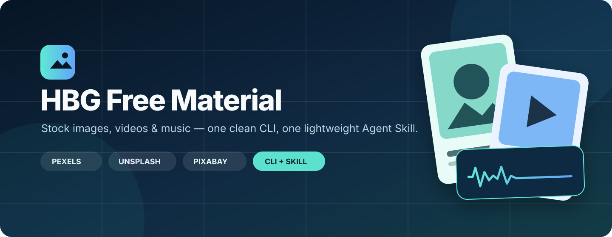
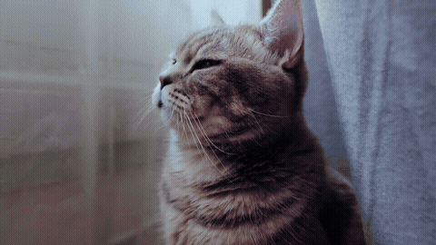
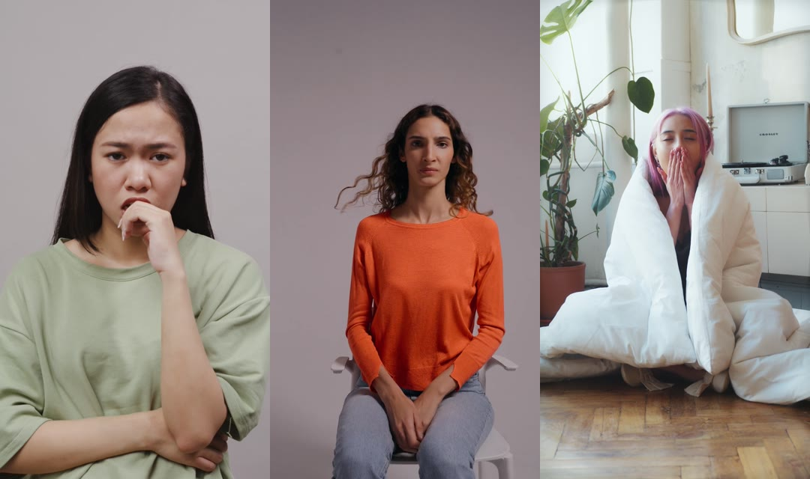
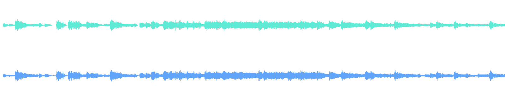
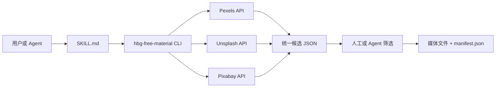

<p align="center">
  
</p>

<p align="center">
  <a href="https://github.com/Mr-funny/hbg-free-material/actions/workflows/ci.yml"></a>
  <a href="LICENSE"></a>
  
  
  
  
</p>

<p align="center">
  用一条 CLI 同时搜索、比较和下载 <strong>Pexels / Unsplash / Pixabay</strong> 的图片与视频，<br />
  保存作者、来源页与许可信息，并以轻量 Agent Skill 按需调用。
</p>

```bash
hbg-free-material search "Hong Kong cha chaan teng" --platform all --per-page 5 --json
hbg-free-material video download "cat running in a garden" --platform all --count 2 --quality hd --json
```

## 🎬 真实素材演示

下面的图片、视频和音乐都由本工具从真实图库工作流中取得，并保留来源记录。

### 三个平台，一次搜索

| Pexels | Unsplash | Pixabay |
|:---:|:---:|:---:|
| 图片与视频 | 图片 | 图片与视频、音乐下载 |


### 视频搜索与质量选择



支持 `best`、`hd`、`sd`、`small` 四档质量。搜索结果会返回候选分辨率、时长、作者、预览地址、下载地址与来源页。

### 真正进入竖屏短视频生产



这些竖屏实拍素材来自一次真实的心理学书籍视频制作：代理先围绕“焦虑反应、建立边界、自我保护”拆搜索词，再比较人物动作、构图和时长，最后下载选中的 1080p 镜头。也就是说，它不是只会返回猫图的 Demo，而是能进入实际内容生产链路。

### 批量地标素材


这些图片曾被用于 1080p / 60fps 的“万物生长”地标动画：先搜索素材，再筛选构图，最后由 CLI 下载并生成 `manifest.json`。

### 音乐也能进入同一条素材链路



音乐搜索通过真实浏览器完成，CLI 负责下载已选中的 Pixabay CDN 文件、记录作者与来源，并可启动仅限本机的 Range Proxy。

▶️ **[播放 12 秒有声综合演示](docs/showcase/showcase-demo.mp4)**

所有 README 展示素材的作者、来源页和许可链接见 [Showcase Sources](docs/showcase/SOURCES.md)。仓库只保留压缩后的组合展示，不提供原始素材包或完整音乐文件。

## ✨ 为什么做这个工具

很多图库工具只解决“搜到链接”，真正进入 AI 视频或内容生产时，还需要处理：

- 同时搜索多个平台并统一字段。
- 在下载前比较构图、方向、分辨率、时长和质量。
- 下载指定候选，而不是永远取第一条结果。
- 为 Unsplash 正确执行下载追踪请求。
- 把作者、来源页和许可地址保存到相邻 manifest。
- 控制图片、视频和音频的最大下载体积。
- 让 Codex 等代理按需读取 Skill，而不是长期注册一组 MCP 工具。

`hbg-free-material` 把这些工作统一成可脚本化、可审计的 JSON CLI。

## 🌟 功能

| 功能 | Pexels | Unsplash | Pixabay |
|---|:---:|:---:|:---:|
| 图片搜索与下载 | ✅ | ✅ | ✅ |
| 视频搜索与下载 | ✅ | — | ✅ |
| 视频质量选择 | ✅ | — | ✅ |
| 音乐文件下载 | — | — | ✅ 浏览器选曲后 |
| 作者与来源记录 | ✅ | ✅ | ✅ |
| Provider License 链接 | ✅ | ✅ | ✅ |
| JSON 输出 | ✅ | ✅ | ✅ |

另外提供：

- CLI 本地安装与 Docker 两种运行方式。
- 面向 Codex / Claude Code 的 `SKILL.md`。
- 平台间 Round-robin 批量选择，减少单一来源偏置。
- SSRF 基础防护、媒体类型校验、临时文件与下载体积限制。
- 仅允许 `cdn.pixabay.com/audio/` 的本地音乐代理。

## 📦 安装

### 一键安装 CLI + Codex Skill

```bash
curl -fsSL https://raw.githubusercontent.com/Mr-funny/hbg-free-material/main/install.sh | sh
```

默认会：

1. 创建独立 Python 虚拟环境。
2. 将 `hbg-free-material` 和短命令 `hbg-material` 链接到 `~/.local/bin`。
3. 把 Skill 安装到 `~/.codex/skills/hbg-free-material`。

如果 `~/.local/bin` 还不在 `PATH`：

```bash
export PATH="$HOME/.local/bin:$PATH"
```

只安装 CLI：

```bash
curl -fsSL https://raw.githubusercontent.com/Mr-funny/hbg-free-material/main/install.sh | sh -s -- --cli-only
```

安装 Claude Code Skill：

```bash
curl -fsSL https://raw.githubusercontent.com/Mr-funny/hbg-free-material/main/install.sh | sh -s -- --claude
```

### 使用 pipx

```bash
pipx install git+https://github.com/Mr-funny/hbg-free-material.git
```

### 从源码安装

```bash
git clone https://github.com/Mr-funny/hbg-free-material.git
cd hbg-free-material
python3 -m venv .venv
. .venv/bin/activate
python -m pip install -e .
```

## 🔐 配置 API Key

```bash
cp .env.example .env
```

编辑本地 `.env`，至少填写一个平台：

```dotenv
PEXELS_API_KEY=your_pexels_api_key
UNSPLASH_API_KEY=your_unsplash_access_key
PIXABAY_API_KEY=your_pixabay_api_key
```

- [Pexels API](https://www.pexels.com/api/)
- [Unsplash Developers](https://unsplash.com/developers)
- [Pixabay API](https://pixabay.com/api/docs/)

`.env` 已加入 `.gitignore` 和 `.dockerignore`。CLI 不会把 API Key 写入 JSON、manifest 或下载文件。

检查配置状态：

```bash
hbg-free-material providers
```

## 🚀 CLI 使用

### 搜索图片

```bash
hbg-free-material search "Hong Kong night market food" \
  --platform all --per-page 5 --json
```

### 下载平衡结果

```bash
hbg-free-material download "steaming beef noodle soup" \
  --platform all --count 3 \
  --output-dir ./downloads/food --json
```

当使用 `--platform all` 时，下载会在已配置平台之间 Round-robin 选择，而不是把所有名额都给第一个平台。

### 下载指定图片

```bash
hbg-free-material fetch "DOWNLOAD_URL" \
  --platform pexels \
  --id "PHOTO_ID" \
  --photographer "CREATOR" \
  --source-url "SOURCE_PAGE" \
  --alt "DESCRIPTION" \
  --output-dir ./downloads/selected \
  --json
```

### 搜索和下载视频

```bash
hbg-free-material video search "Hong Kong street at night" \
  --platform all --per-page 5 --quality hd --json

hbg-free-material video download "Hong Kong street at night" \
  --platform all --count 2 --quality hd \
  --output-dir ./downloads/videos/hong-kong --json
```

### 下载 Pixabay 音乐

Pixabay 公共 API 不提供音乐搜索，因此先在真实浏览器选择歌曲，再把公开 CDN URL 交给 CLI：

```bash
hbg-free-material music fetch "https://cdn.pixabay.com/audio/...mp3" \
  --id "TRACK_ID" \
  --artist "ARTIST" \
  --source-url "TRACK_PAGE_URL" \
  --title "TITLE" \
  --duration 120 \
  --output-dir ./downloads/music \
  --json
```

需要浏览器播放器支持 Range 请求时：

```bash
hbg-free-material proxy
hbg-free-material music proxy-url "https://cdn.pixabay.com/audio/...mp3" --json
```

代理默认只监听 `127.0.0.1:8765`，并拒绝非 Pixabay 音频 CDN 地址。

## 🐳 Docker

### 使用 Docker Compose 执行 CLI

```bash
cp .env.example .env
mkdir -p downloads

docker compose --profile cli run --rm cli providers
docker compose --profile cli run --rm cli \
  search "Hong Kong cha chaan teng" --platform all --per-page 5 --json
```

也可以使用仓库中的短脚本：

```bash
./scripts/docker-cli video download "cat playing" \
  --platform all --count 2 --quality small --json
```

### 启动可选音乐代理

```bash
docker compose up -d music-proxy
docker compose ps
curl http://127.0.0.1:8765/health
```

图片和视频命令不需要常驻容器；只有使用音乐 Range Proxy 时才需要后台服务。

## 🤖 Agent Skill

安装 Skill 后，可以直接对 Codex 或 Claude Code 说：

```text
使用 $hbg-free-material，帮我找 6 条适合竖屏心理学短视频的实拍素材。
先返回候选和缩略图，比较人物动作、方向、时长和来源，再下载最终选择。
```

Skill 会引导代理：

1. 将中文需求整理成简洁英文搜索词。
2. 使用 JSON CLI 搜索多个平台。
3. 对比候选，而不是直接下载第一条。
4. 保存选中素材与 `manifest.json`。
5. 在交付时保留作者、来源页和许可链接。

这套方式不要求注册 MCP Server。Skill 只在相关任务触发时加载，CLI 输出也可以按需裁剪，更适合关注上下文占用的工作流。

## 🧠 工作原理



下载 manifest 会保留类似信息：

```json
{
  "platform": "pexels",
  "media_type": "video",
  "id": "7603588",
  "photographer": "G media",
  "source_url": "https://www.pexels.com/video/close-up-view-of-a-cat-7603588/",
  "license_url": "https://www.pexels.com/license/",
  "duration": 10,
  "width": 640,
  "height": 360,
  "file": "downloads/videos/pexels-7603588.mp4"
}
```

## 🗂️ 项目结构

```text
hbg-free-material/
├── src/hbg_free_material/          # Python CLI、Provider API、下载与代理
├── skills/hbg-free-material/       # Codex / Claude Code Agent Skill
├── docs/showcase/                  # README 压缩展示与来源清单
├── tests/                          # CLI 与安全校验测试
├── scripts/docker-cli              # Docker Compose 命令包装
├── Dockerfile
├── compose.yaml
├── install.sh
└── .env.example
```

## ✅ 安全与发布检查

- API Key 只从环境变量或本地 `.env` 读取。
- `.env`、下载目录、缓存和临时文件不会进入 Git。
- 下载 URL 必须是 HTTP(S)，私有或本地 IP 字面量会被拒绝。
- 下载响应必须匹配预期的 `image/*`、`video/*` 或 `audio/*`。
- 文件先写入 `.part`，完成后才原子替换。
- 图片、视频、音频分别有可配置的最大体积限制。
- 音乐代理只接受 `https://cdn.pixabay.com/audio/`。

更多说明见 [SECURITY.md](SECURITY.md)。

## 📜 素材许可说明

本仓库的 MIT License 只覆盖代码、Skill 和文档，不替代素材平台自身许可。

CLI 会保存 Provider License URL，但具体素材可能存在人物肖像、商标、建筑、内容 ID 或平台条款限制。公开发布、广告投放或商业用途前，请检查原始素材页面及最新许可条款。

## 📄 License

代码、Agent Skill 与项目文档使用 [MIT License](LICENSE)。
